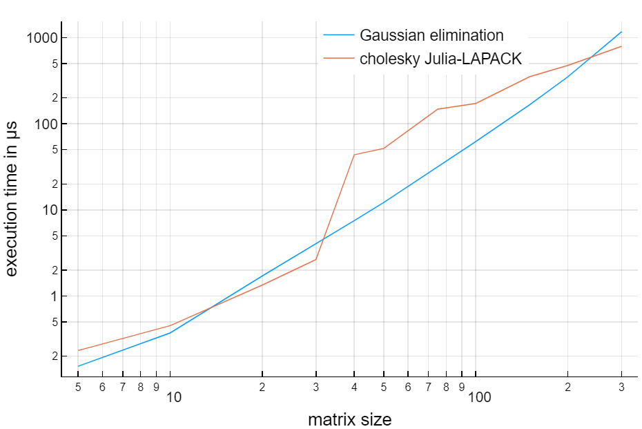

## Cholesky Benchmark

The *choleskyBenchmark.jl* script benchmarks Julia's [cholesky](https://docs.julialang.org/en/v1/stdlib/LinearAlgebra/#LinearAlgebra.cholesky) method based on LAPACK, against a modified symmetric Gaussian elimination procedure written by the author
based on the seminal work of Alan Turing (1948).

Those being deterministic algorithms, the minimum execution time
across several trials is considered (using the [BenchmarkTool.jl](https://github.com/JuliaCI/BenchmarkTools.jl) package).
The following matrix size values are benchmarked:

5, 10, 20, 30, 40, 50, 75, 100, 150, 200, 300

As shown in the figure (log-log plot), for 5x5 and 10x10 matrices Gaussian elimination is faster, while the opposite
is true for 20x20 and 30x30 matrices.
In between matrix size 30 and 40 the `cholesky`
algorithm changes behavior, probably switching to partitioned mode (see Higham, 2011, p.5). This actually jeopardizes the performance, making it worse up to size 200. For larger matrices `cholesky` is clearly faster.

| Figure 'AJD Benchmark'  |  Legend                |
|:-----------------------:|:-----------------------|
|  | *Minimum execution time in μs for several values of matrix size. For both algoritms the reported time includes overheads for copying the input matrix and making checks. The benchmark has been run on a Dell Latitude 5490 laptop equipped with an Intel i7-8650U CPU @1.90GHz(base)-4.20GHz(Max Turbo) and with 32Go of RAM*  |

### References

N.J. Higham (2011)
[Gaussian Elimination](http://eprints.maths.manchester.ac.uk/1579/1/lu5a.pdf)
WIREs Computational Statistics, 3(3), 230-238.

A. M. Turing (1948)
[Rounding Off Errors in Matrix Processes](shorturl.at/imGVX)
Quarterly Journal of Mechanical and Applied Math, 1(1), 287-308.
