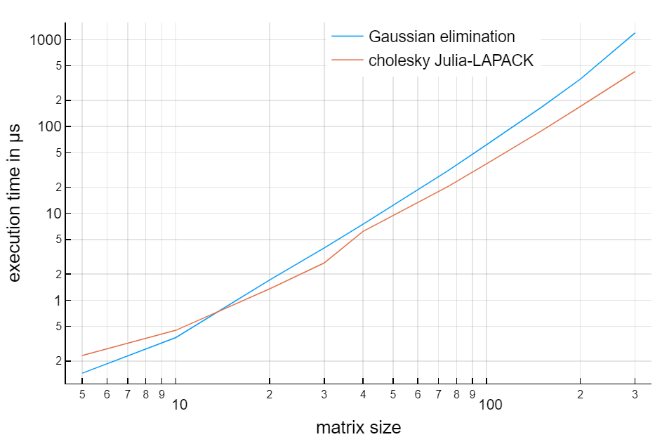

## Cholesky Benchmark

The *choleskyBenchmark.jl* script benchmarks Julia's
[cholesky](https://docs.julialang.org/en/v1/stdlib/LinearAlgebra/#LinearAlgebra.cholesky)
method based on LAPACK, against a modified symmetric Gaussian elimination
procedure written by the author based on the seminal work of Alan Turing (1948).

Those being deterministic algorithms, the minimum execution time
across several trials is considered (using the
[BenchmarkTool.jl](https://github.com/JuliaCI/BenchmarkTools.jl) package).
The following matrix size values are benchmarked:

5, 10, 20, 30, 40, 50, 75, 100, 150, 200, 300

As exaplined by Higham (2011, p.5), LAPACK Gaussian elimination algorithms
(including LU and Cholesky actorizations) switch to partitioned mode
above a certain matrix size value, transforming part of the recursons
into matrix-matrix operations, which can be parallelized.
This is illustrated in the following figures (log-log plots):

In Fig. 1 we allowe BLAS to use 8 threads.
The transition to partitioned mode happens in between matrix size 30 and 40.
This actually jeopardizes the performance until size 200.
For larger matrices the multi-threading is clearly faster.
In Fig. 2 we allow BLAS to use only one thread. This makes the algorithm
behaving pretty much like the (non-partitioned) recursion.

| Figure 'AJD Benchmark'  |  Legend                |
|:-----------------------:|:-----------------------|
|  | *Minimum execution time in μs for several values of matrix size. BLAS is allowed to use 8 threads |
|  | *Minimum execution time in μs for several values of matrix size. BLAS is allowed to use 1 threads*  |

*For both algoritms the reported time includes overheads for copying the input matrix and making checks. The benchmark has been run on a Dell Latitude 5490 laptop equipped with an Intel i7-8650U CPU @1.90GHz(base)-4.20GHz(Max Turbo) and with 32Go of RAM*  

### References

N.J. Higham (2011)
[Gaussian Elimination](http://eprints.maths.manchester.ac.uk/1579/1/lu5a.pdf)
WIREs Computational Statistics, 3(3), 230-238.

A. M. Turing (1948)
[Rounding Off Errors in Matrix Processes](shorturl.at/imGVX)
Quarterly Journal of Mechanical and Applied Math, 1(1), 287-308.
